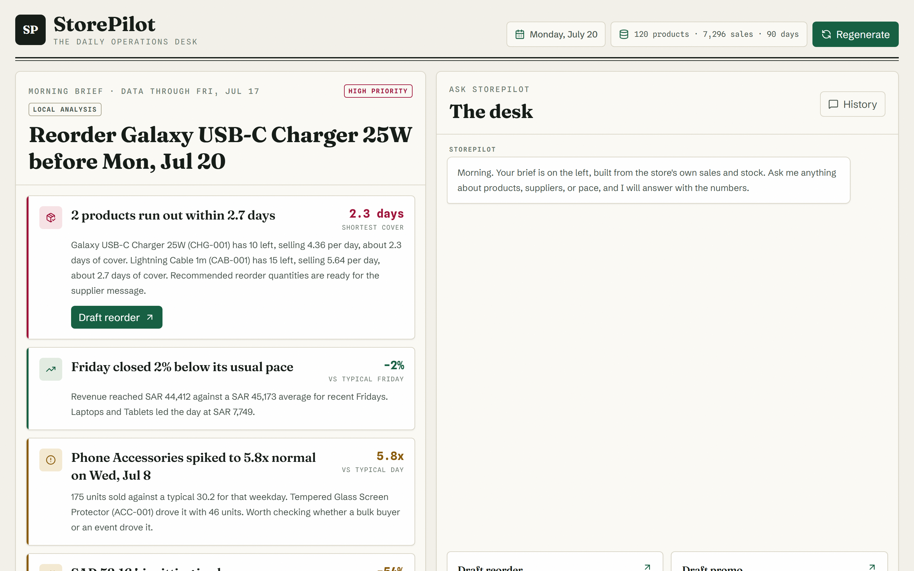
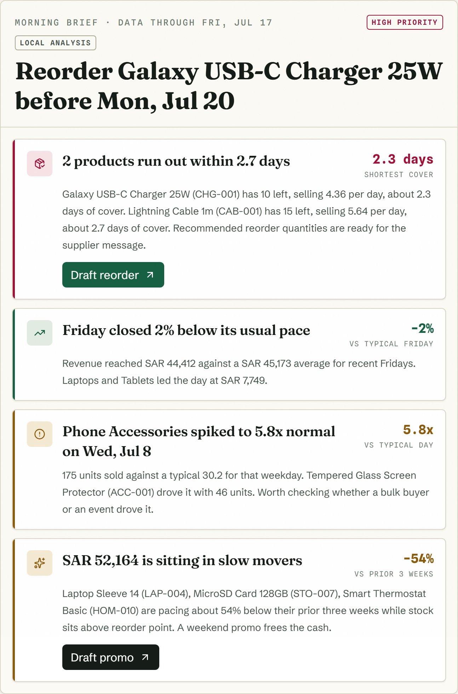
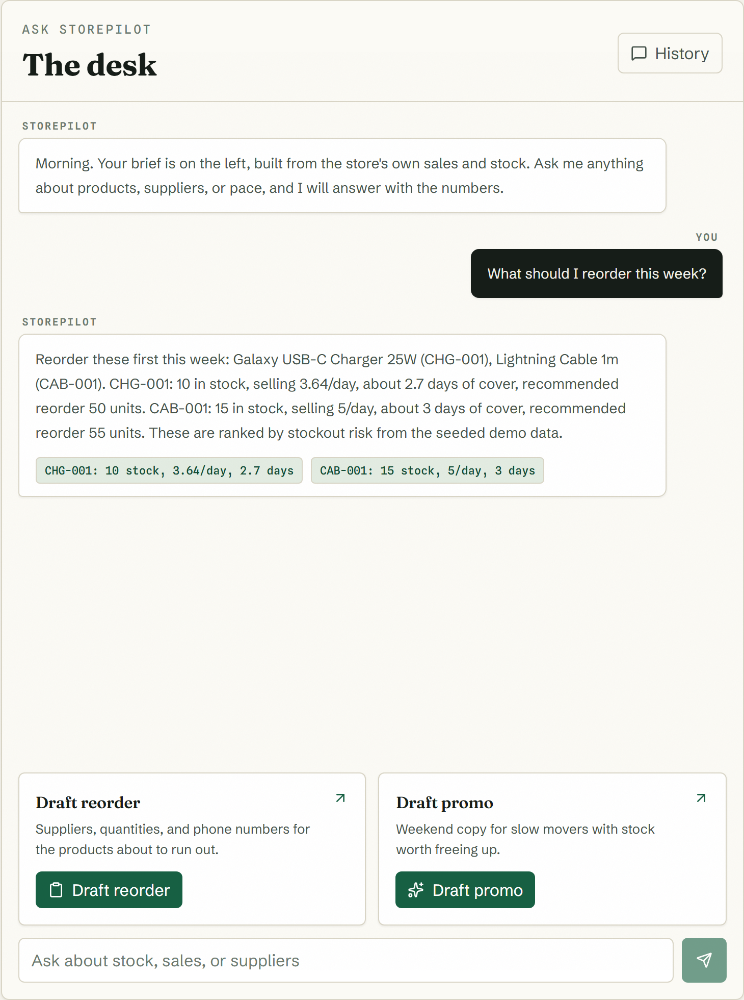
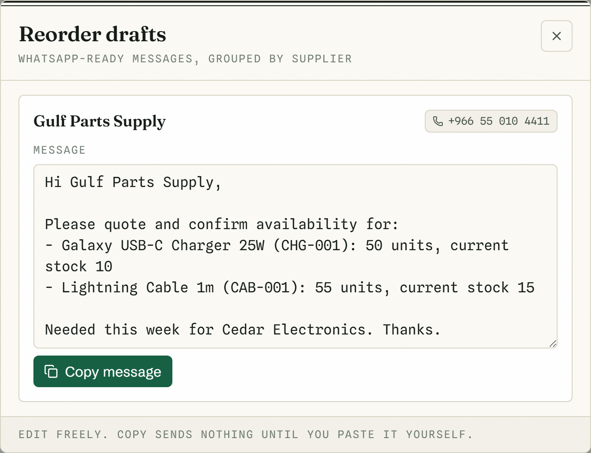

<div align="center">

# StorePilot

**The AI store manager for small retailers.**

Reads your sales and stock every morning. Tells you the three things that need doing today. Drafts the messages that do them.

[](https://nextjs.org)
[](https://www.typescriptlang.org)
[](https://platform.openai.com)
[](#the-numbers-are-real)
[](LICENSE)

**Try it live: [storepilot-demo.vercel.app](https://storepilot-demo.vercel.app)** (seeded demo store, no signup)



</div>

---

## The problem

Most of the world's small shops run on gut feeling. No analyst, no demand planning, no time. The data to run the store better already sits in the sales and stock tables; nobody reads it. I run retail businesses in Saudi Arabia and sell POS systems to exactly these shops, and I have watched owners discover a stockout by staring at an empty shelf.

StorePilot is the manager who reads the data so the owner does not have to.

## What it does

### 1. The Morning Brief opens the conversation

Every morning StorePilot analyzes the store's own data: revenue pace against the typical weekday, category-level anomaly detection, stockout forecasting from live velocity, and slow movers tying up cash. GPT-5.6 writes the briefing from those verified facts through structured outputs, so the copy reads like a sharp human manager and the numbers are never hallucinated.

<div align="center"></div>

### 2. Ask anything, get answers with evidence

An agentic chat over the store database. GPT-5.6 decides which tools to call (`query_sales`, `get_inventory`, `forecast_stockouts`, `compose_supplier_message`, `draft_promo`), the server executes them with zod-validated inputs through Prisma, and answers stream back with evidence chips showing the exact numbers behind every claim.

<div align="center"></div>

### 3. Insight becomes action in two clicks

The stockout card becomes a WhatsApp-ready supplier reorder message, grouped by supplier with recommended quantities and phone numbers. Slow movers become promo copy with a discount and channel picker. Everything is editable, and nothing sends until the owner pastes it themselves.

<div align="center"></div>

## The numbers are real

The design principle behind the whole app: **the model narrates, deterministic code calculates.**

- Forecasts, anomaly ratios, and reorder quantities come from tested math over real rows (Vitest covers the forecast and analysis engines against planted fixtures).
- GPT-5.6 does what models are best at: choosing tools, explaining, and writing. Structured outputs lock the briefing to verified facts.
- Every number in the UI is traceable to a query. Evidence chips make that visible to the user.

```
Morning Brief   /api/brief     analyze (pure fns) -> compose (facts) -> GPT-5.6 rewrite (json_schema)
Chat            /api/chat      GPT-5.6 tool loop -> zod-validated tools -> Prisma -> NDJSON stream
Actions         /api/actions   compose_supplier_message / draft_promo, deterministic
```

## Quickstart

```bash
pnpm install
cp .env.example .env        # put your OPENAI_API_KEY in .env
pnpm db:local               # supervised PGlite Postgres on :5433 (keep running)
pnpm db:seed                # 90 days of demo data for Cedar Electronics
pnpm dev
```

Open http://localhost:3000. Verify the data at http://localhost:3000/api/health.

Without an API key the app runs fully in a local demo mode (deterministic brief, grounded canned chat), and the brief panel labels which mode produced it. With the key, GPT-5.6 writes the brief and drives the chat.

## Demo data

`pnpm db:seed` builds a deterministic 90-day electronics store: 120 SKUs across 9 categories, 6 suppliers, weekend-peaked seasonality, a planted category spike for the anomaly detector to find, two products burning toward stockout, and three slow movers with excess stock. Same seed, same stories, every time.

## Deploy (Vercel + Neon)

1. Create a Neon Postgres database and copy the pooled connection string.
2. Set `DATABASE_URL`, `OPENAI_API_KEY`, `OPENAI_MODEL=gpt-5.6`, and `NEXT_PUBLIC_APP_URL` in Vercel.
3. Import the repo; the build is a standard `next build`.
4. Seed production once: `DATABASE_URL=<neon-url> pnpm db:seed`.

## Stack

| Layer | Choice |
| --- | --- |
| Framework | Next.js 15 App Router, TypeScript, Tailwind CSS 4 |
| Database | Postgres via Prisma (supervised PGlite locally, Neon in production) |
| AI | OpenAI Responses API, GPT-5.6, function tools + structured outputs |
| Tests | Vitest: forecast math, schema validation, brief analysis |
| Type | Fraunces, Schibsted Grotesk, Spline Sans Mono |

## Roadmap

CSV import so any shop onboards in a minute, WhatsApp send integration, weekly email digest, multi-store support.

---

<div align="center">

Built by **Saud Satopay** for OpenAI Build Week 2026, Work & Productivity track, with GPT-5.6 and Codex.

MIT licensed.

</div>
